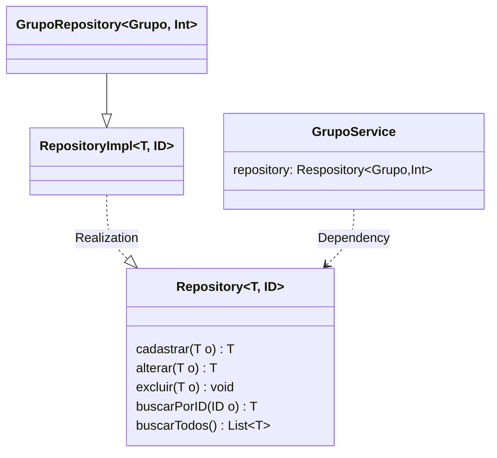

```mermaid 
classDiagram

RepositoryImpl~T, ID~  ..|> Repository~T, ID~  : Realization
GrupoRepository~Grupo, Int~ --|> RepositoryImpl~T, ID~
GrupoService ..> Repository : Dependency

class GrupoService{
    repository: Respository~Grupo,Int~
}

class Repository~T, ID~{
  cadastrar(T o)   T 
  alterar(T o)  T  
  excluir(T o)  void
  buscarPorID(ID  o)  T
  buscarTodos()  List~T~ 
}

```